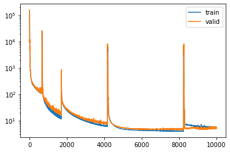

Toy experiment: Molecular mechanics (MM) fitting on subsampled PhAlkEthOH dataset.
==================================================================================

**Open in Google Colab**:
http://data.wangyq.net/esp_notebooks/phalkethoh_mm_small.ipynb

This notebook is intended to recover the MM fitting behavior in
https://arxiv.org/abs/2010.01196

To assess how well Espaloma can learn to reproduce an MM force field
from a limited amount of data, we selected a chemical dataset of limited
complexity—PhAlkEthOH—which consists of linear and cyclic molecules
containing phenyl rings, small alkanes, ethers, and alcohols composed of
only the elements carbon, oxygen, and hydrogen. We generated a set of
conformational snapshots for each molecule using short high-temperature
molecular dynamics simulations at 300~K initiated from multiple
conformations to ensure adequate sampling of conformers. The AlkEthOH
dataset was randomly partitioned (by molecules) into 80% training, 10%
validation, and 10% test molecules, with 100 snapshots/molecule, and an
Espaloma model was trained with early stopping via monitoring for a
decrease in accuracy in the validation set.

.. image:: https://pbs.twimg.com/media/FBL0qACXIBkJLQZ?format=png&name=4096x4096

Installation and imports
------------------------

.. code:: python

    # install conda
    ! pip install -q condacolab
    import condacolab
    condacolab.install()

.. parsed-literal::

    ⏬ Downloading https://github.com/jaimergp/miniforge/releases/latest/download/Mambaforge-colab-Linux-x86_64.sh...
    📦 Installing...
    📌 Adjusting configuration...
    🩹 Patching environment...
    ⏲ Done in 0:00:34
    🔁 Restarting kernel...

.. code:: python

    %%capture
    ! mamba install --yes --strict-channel-priority --channel jaimergp/label/unsupported-cudatoolkit-shim --channel omnia --channel omnia/label/cuda100 --channel dglteam --channel numpy openmm openmmtools openmmforcefields rdkit openff-toolkit dgl-cuda10.0 qcportal

.. code:: python

    ! git clone https://github.com/choderalab/espaloma.git

.. parsed-literal::

    Cloning into 'espaloma'...
    remote: Enumerating objects: 7812, done.
    remote: Counting objects: 100% (3634/3634), done.
    remote: Compressing objects: 100% (1649/1649), done.
    remote: Total 7812 (delta 2714), reused 2639 (delta 1900), pack-reused 4178
    Receiving objects: 100% (7812/7812), 13.50 MiB | 11.77 MiB/s, done.
    Resolving deltas: 100% (5538/5538), done.

.. code:: python

    import torch
    import sys
    sys.path.append("/content/espaloma")
    import espaloma as esp

.. parsed-literal::

    Warning: importing 'simtk.openmm' is deprecated.  Import 'openmm' instead.
    Warning: Unable to load toolkit 'OpenEye Toolkit'. The Open Force Field Toolkit does not require the OpenEye Toolkits, and can use RDKit/AmberTools instead. However, if you have a valid license for the OpenEye Toolkits, consider installing them for faster performance and additional file format support: https://docs.eyesopen.com/toolkits/python/quickstart-python/linuxosx.html OpenEye offers free Toolkit licenses for academics: https://www.eyesopen.com/academic-licensing

Load dataset
------------

Here we load the PhAlKeThoh dataset and shuffle before splitting into
training, validation, and test (80%:10%:10%)

.. code:: python

    %%capture
    ! wget http://data.wangyq.net/esp_dataset/phalkethoh_mm_small.zip
    ! unzip phalkethoh_mm_small.zip

.. code:: python

    ds = esp.data.dataset.GraphDataset.load("phalkethoh")
    ds.shuffle(seed=2666)
    ds_tr, ds_vl, ds_te = ds.split([8, 1, 1])

.. parsed-literal::

    DGL backend not selected or invalid.  Assuming PyTorch for now.
    Using backend: pytorch

.. parsed-literal::

    Setting the default backend to "pytorch". You can change it in the ~/.dgl/config.json file or export the DGLBACKEND environment variable.  Valid options are: pytorch, mxnet, tensorflow (all lowercase)

A training dataloader is constructed with ``batch_size=100``

.. code:: python

    ds_tr_loader = ds_tr.view(batch_size=100, shuffle=True)

.. code:: python

    g_tr = next(iter(ds_tr.view(batch_size=len(ds_tr))))
    g_vl = next(iter(ds_vl.view(batch_size=len(ds_vl))))

.. parsed-literal::

    /usr/local/lib/python3.7/site-packages/dgl/base.py:45: DGLWarning: From v0.5, DGLHeteroGraph is merged into DGLGraph. You can safely replace dgl.batch_hetero with dgl.batch
      return warnings.warn(message, category=category, stacklevel=1)

Define model
------------

Define Espaloma stage I: graph -> atom latent representation

.. code:: python

    representation = esp.nn.Sequential(
        layer=esp.nn.layers.dgl_legacy.gn("SAGEConv"), # use SAGEConv implementation in DGL
        config=[128, "relu", 128, "relu", 128, "relu"], # 3 layers, 128 units, ReLU activation
    )

Define Espaloma stage II and III: atom latent representation -> bond,
angle, and torsion representation and parameters. And compose all three
Espaloma stages into an end-to-end model.

.. code:: python

    readout = esp.nn.readout.janossy.JanossyPooling(
        in_features=128, config=[128, "relu", 128, "relu", 128, "relu"],
        out_features={              # define modular MM parameters Espaloma will assign
            1: {"e": 1, "s": 1}, # atom hardness and electronegativity
            2: {"log_coefficients": 2}, # bond linear combination, enforce positive
            3: {"log_coefficients": 2}, # angle linear combination, enforce positive
            4: {"k": 6}, # torsion barrier heights (can be positive or negative)
        },
    )
    
    espaloma_model = torch.nn.Sequential(
                     representation, readout, esp.nn.readout.janossy.ExpCoefficients(),
                     esp.mm.geometry.GeometryInGraph(), 
                     esp.mm.energy.EnergyInGraph(),
                     esp.mm.energy.EnergyInGraph(suffix="_ref"),
                     esp.nn.readout.charge_equilibrium.ChargeEquilibrium(),
    )

.. code:: python

    if torch.cuda.is_available():
        espaloma_model = espaloma_model.cuda()

Loss function is specified as the MSE between predicted and reference
energy.

.. code:: python

    loss_fn = esp.metrics.GraphMetric(
            base_metric=torch.nn.MSELoss(), # use mean-squared error loss
            between=['u', "u_ref"],         # between predicted and QM energies
            level="g", # compare on graph level
    )

Define optimizer
----------------

.. code:: python

    optimizer = torch.optim.Adam(espaloma_model.parameters(), 1e-4)

Train it!
---------

.. code:: python

    for idx_epoch in range(10000):
        for g in ds_tr_loader:
            optimizer.zero_grad()
            if torch.cuda.is_available():
                g = g.to("cuda:0")
            g = espaloma_model(g)
            loss = loss_fn(g)
            loss.backward()
            optimizer.step()
            torch.save(espaloma_model.state_dict(), "%s.th" % idx_epoch)

.. parsed-literal::

    /usr/local/lib/python3.7/site-packages/dgl/base.py:45: DGLWarning: From v0.5, DGLHeteroGraph is merged into DGLGraph. You can safely replace dgl.batch_hetero with dgl.batch
      return warnings.warn(message, category=category, stacklevel=1)
    /usr/local/lib/python3.7/site-packages/dgl/base.py:45: DGLWarning: dgl.to_homo is deprecated. Please use dgl.to_homogeneous
      return warnings.warn(message, category=category, stacklevel=1)

Inspect
-------

.. code:: python

    inspect_metric = esp.metrics.GraphMetric(
            base_metric=torch.nn.L1Loss(), # use mean-squared error loss
            between=['u', "u_ref"],         # between predicted and QM energies
            level="g", # compare on graph level
    )

.. code:: python

    if torch.cuda.is_available():
        g_vl = g_vl.to("cuda:0")
        g_tr = g_tr.to("cuda:0")

.. code:: python

    loss_tr = []
    loss_vl = []

.. code:: python

    for idx_epoch in range(10000):
        espaloma_model.load_state_dict(
            torch.load("%s.th" % idx_epoch)
        )
    
        espaloma_model(g_tr)
        loss_tr.append(inspect_metric(g_tr).item())
    
        espaloma_model(g_vl)
        loss_vl.append(inspect_metric(g_vl).item())

.. parsed-literal::

    /usr/local/lib/python3.7/site-packages/dgl/base.py:45: DGLWarning: dgl.to_homo is deprecated. Please use dgl.to_homogeneous
      return warnings.warn(message, category=category, stacklevel=1)

.. code:: python

    import numpy as np
    loss_tr = np.array(loss_tr) * 627.5
    loss_vl = np.array(loss_vl) * 627.5

.. code:: python

    from matplotlib import pyplot as plt 
    plt.plot(loss_tr, label="train")
    plt.plot(loss_vl, label="valid")
    plt.yscale("log")
    plt.legend()

.. parsed-literal::

    <matplotlib.legend.Legend at 0x7fd8f0eebd90>

