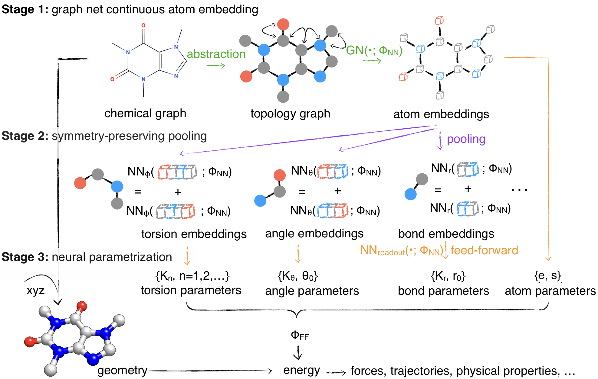

Getting Started
===============

Paper Abstract
--------------
Molecular mechanics (MM) potentials have long been a workhorse of computational chemistry.
Leveraging accuracy and speed, these functional forms find use in a wide variety of applications in biomolecular modeling and drug discovery, from rapid virtual screening to detailed free energy calculations.
Traditionally, MM potentials have relied on human-curated, inflexible, and poorly extensible discrete chemical perception rules _atom types_ for applying parameters to small molecules or biopolymers, making it difficult to optimize both types and parameters to fit quantum chemical or physical property data.
Here, we propose an alternative approach that uses _graph neural networks_ to perceive chemical environments, producing continuous atom embeddings from which valence and nonbonded parameters can be predicted using invariance-preserving layers.
Since all stages are built from smooth neural functions, the entire process---spanning chemical perception to parameter assignment---is modular and end-to-end differentiable with respect to model parameters, allowing new force fields to be easily constructed, extended, and applied to arbitrary molecules.
We show that this approach is not only sufficiently expressive to reproduce legacy atom types, but that it can learn and extend existing molecular mechanics force fields, construct entirely new force fields applicable to both biopolymers and small molecules from quantum chemical calculations, and even learn to accurately predict free energies from experimental observables.

Minimal Example
---------------
::

    import torch, dgl, espaloma as esp

    # retrieve QM dataset used to train OpenFF 1.0.0 ("parsley") small molecule force field
    dataset = esp.data.dataset.GraphDataset.load("parsley").view(batch_size=128)

    # define Espaloma stage I: graph -> atom latent representation
    representation = esp.nn.Sequential(
        layer=esp.nn.layers.dgl_legacy.gn("SAGEConv"), # use SAGEConv implementation in DGL
        config=[128, "relu", 128, "relu", 128, "relu"], # 3 layers, 128 units, ReLU activation
    )

    # define Espaloma stage II and III:
    # atom latent representation -> bond, angle, and torsion representation and parameters
    readout = esp.nn.readout.janossy.JanossyPooling(
        in_features=128,
        config=[128, "relu", 128, "relu", 128, "relu"],
        out_features={              # define modular MM parameters Espaloma will assign
            1: {"e": 1, "s": 1},
            2: {"coefficients": 2}, # bond linear combination
            3: {"coefficients": 3}, # angle linear combination
            4: {"k": 6}, # torsion barrier heights (can be positive or negative)
        },
    )

    # compose all three Espaloma stages into an end-to-end model
    espaloma_model = torch.nn.Sequential(
                     representation,
                     readout,
                     esp.mm.geometry.GeometryInGraph(),
                     esp.mm.energy.EnergyInGraph(),
                     esp.nn.readout.charge_equilibrium.ChargeEquilibrium(),
    )

    # define training metric
    metrics = [
        esp.metrics.GraphMetric(
                base_metric=torch.nn.MSELoss(), # use mean-squared error loss
                between=['u', "u_ref"],         # between predicted and QM energies
                level="g",
        )
        esp.metrics.GraphMetric(
                base_metric=torch.nn.MSELoss(), # use mean-squared error loss
                between=['q', "q_hat"],         # between predicted and reference charges
                level="n1",
        )
    ]

    # fit Espaloma model to training data
    results = esp.Train(
        ds_tr=dataset, net=espaloma_model, metrics=metrics,
        device=torch.device('cuda:0'), n_epochs=5000,
        optimizer=lambda net: torch.optim.Adam(net.parameters(), 1e-3), # use Adam optimizer
    ).run()
